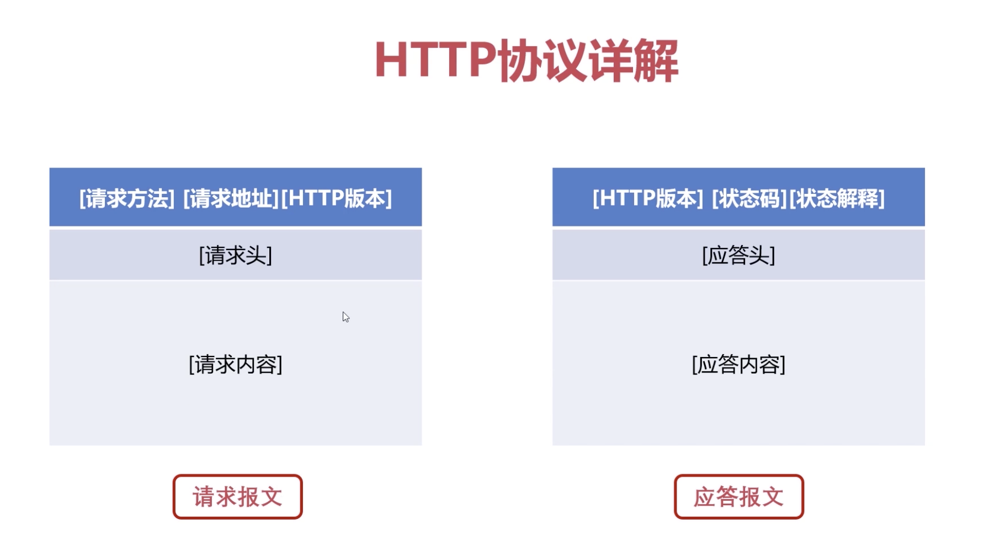

### 网络层

决定数据在网络中传输路径

#### ip协议

虚拟互联网络：IP协议使一个复杂的实际网络变为虚拟网络

mac地址 对于数据链路层， IP地址对于网络来说，都是唯一身份

不同点： mac地址不可改变，ip地址会变

IP地址32位 0-255  ，mac地址48位

IP协议组成：帧首部 IP数据报 帧尾部
* IP数据报：IP首部，IP数据报数据

#### HTTP协议

常见协议：get, post, delete, updata;

在地址中指定参数，在请求数据中指定

